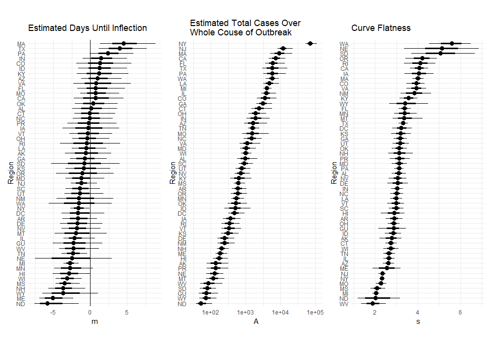

# covid19

Bayesian estimation of the number of cases of COVID-19 in the United States. 

Hierarchical model assuming cumulative counts are distributed according to a negative binomial distribution around a logistic growth curve. Inflection and flatness parameters partially pooled across states. 

Goals
 1. Provide a robust data collection system
 2. Predict number of cases, when, where

Latest Predictions

